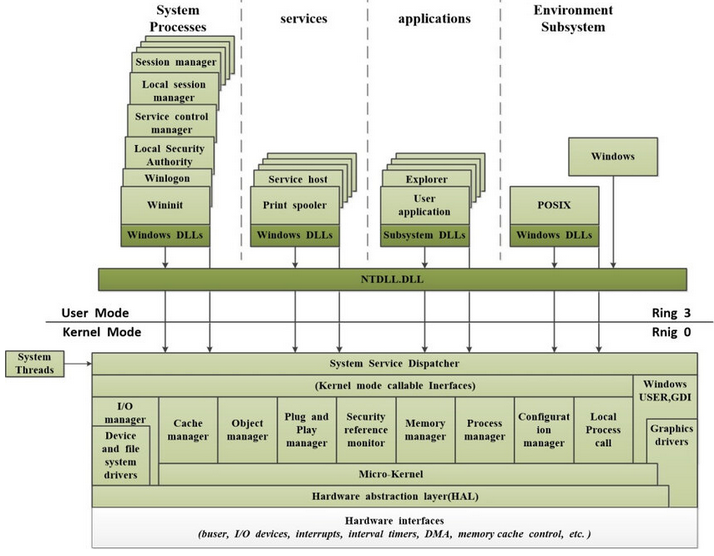

| 🏠 [Home](../../redteam.md) | ⬅️ ⬅️ [Part](../_part) | ⬅️ [Chapter](./_chapter) |
|-----------------------------|----------------------|-------------------------|

* [Detailed system architecture](../../knowledge/internals/archi.md)
    * [Environment subsystems and subsystem DLLs](../../knowledge/internals/archi.md#environment-subsystems-and-subsystem-dlls)
        * [Introduction](../../knowledge/internals/archi.md#introduction)
        * [Subsystem startup](../../knowledge/internals/archi.md#subsystem-startup)
        * [Windows subsystem](../../knowledge/internals/archi.md#windows-subsystem)
        * [Other subsystem, Pico providers and WSL](../../knowledge/internals/archi.md#other-subsystem-pico-providers-and-wsl)
    * [Ntdll.dll](../../knowledge/internals/archi.md#ntdlldll)
    * [Executive](../../knowledge/internals/archi.md#executive)
        * [Object manager](../../knowledge/internals/archi.md#object-manager)
    * [system service dispatcher](../../knowledge/internals/archi.md#system-service-dispatcher)
    * [Kernel](../../knowledge/internals/archi.md#kernel)
    * [Hardware abstraction layer](../../knowledge/internals/archi.md#hardware-abstraction-layer)
    * [System processes](../../knowledge/internals/archi.md#system-processes)

# Detailed system architecture

{#fig:windows_detailed_archi
width="\\linewidth"}

## Environment subsystems and subsystem DLLs

### Introduction

-   **Environment subsystem** expose some subset of the base Windows
    executive system services to application programs.

-   Each subsystem can provide access to different subsets of the native
    services in Windows.

-   Each executable image is bound to one and only one subsystem.

-   When an image is run, the process creation code examines the
    subsystem type code in the image header so that it can notify the
    proper subsystem of the new process

-   user applications don't call Windows system services directly.
    Instead, they go through one or more subsystem DLLs.

-   The **environment subsystem processes**, running in user mode, are
    responsible for maintaining the state of the client applications
    running under their control.

When an application calls a function in a subsystem DLL, one of three
things can occur:

-   The function is entirely implemented in user mode inside the
    subsystem DLL.

-   The function requires one or more calls to the Windows executive.

-   The function requires some work to be done in the environment
    subsystem process. In this case, a client/server request is made to
    the environment subsystem via an ALPC message sent to the subsystem
    to perform some operation. The subsystem DLL then waits for a reply
    before returning to the caller.

Some functions can be a combination of the second and third items just
listed.

### Subsystem startup

Subsystems are started by the Session Manager subsystem (SMSS) according
to `HKLM\SYSTEM\CurrentControlSet\Control\Session Manager\SubSystems`

-   `Required` value: list String that must be defined as registry value
    and define the list of the subsystems that load when the system
    boots

-   `Optional` value: (load on demand)

-   `kmode`: contains the file name of the kernel-mode portion of the
    Windows subsystem, `Win32k.sys`

### Windows subsystem

**All subsystem rely on Windows subsystem to perform display I/O.**

The Windows subsystem consists of the following major components:

-   For each session, an instance of the
    [CSRSS](https://medium.com/@ijaz.faheem/windows-environment-subsystems-csrss-synch-with-windows-kernel-on-the-windows-user-process-164d57f2a81b)
    loads four DLLs (`Basesrv.dll`, `Winsrv.dll`, `Sxssrv.dll`, and
    `Csrsrv.dll`) that contain support for the following:

    -   Various housekeeping tasks related to creating and deleting
        processes and threads

    -   Shutting down Windows applications

    -   Sending certain kernel notification messages to Windows
        applications as Window messages

    -   Side-by-Side (SxS)/Fusion and manifest cache support

    -   Several natural language support functions, to provide caching

-   A **kernel-mode device driver** (Win32k.sys) that contains the
    following:

    -   The window manager (controls window displays; manages screen
        output; collects input from keyboard, mouse, and other devices;
        and passes user messages to applications)

    -   The Graphics Device Interface (GDI), which is a library of
        functions for graphics output devices

    -   Wrappers for DirectX

-   The **console host process** (Conhost.exe), which provides support
    for console (character cell) applications

-   The Desktop Window Manager

-   Subsystem DLLs

-   Graphics device drivers

**CSRSS**:

Windows Kernel creates the process and thread and returns the handles to
the method CreateProcessInternal (Kernelbase.dll). The
CreateProcessInternal performs security operations (e.g., SxS) and
constructs and sends a message to the Csrss process. The message
contains information about process & thread handles, section objects,
flags, and other required information etc.

The Csrss is a critical system process, and it is responsible for
managing the graphical user interface (GUI) on Windows systems. It also
creates the process and keeps them in the organized process list. The
process also monitors the user mode processes, and it can terminate a
process if it crashes or because of any security issue.

The Csrss takes the process and thread handles and creates the duplicate
process(`CSR_Process`) and thread(`CSR_Thread`) to monitor the process
for Windows Subsystem.

The Csrss push the new process into the windows-subsystem wide process
list(aka managed processes) on the successful creation of the Csrss
process.

**Win32k.sys**

The basic window-management requirements for Windows 10--based devices
vary considerably depending on the device in question. For these
reasons, the functionality of Win32K.sys has been split among several
kernel modules so that not all modules may be required on a specific
system. This significantly reduces the attack surface of the window
manager by reducing the complexity of the code and eliminating many of
its legacy pieces.

Applications call the standard USER functions to create user-interface
controls, such as windows and buttons, on the display. The window
manager communicates these requests to the GDI, which passes them to the
graphics device drivers, where they are formatted for the display
device. A display driver is paired with a video miniport driver to
complete video display support.

The GDI provides a set of standard two-dimensional functions that let
applications communicate with graphics devices without knowing anything
about the devices. GDI functions mediate between applications and
graphics devices such as display drivers and printer drivers. The GDI
interprets application requests for graphic output and sends the
requests to graphics display drivers. It also provides a standard
interface for applications to use varying graphics output devices. This
interface enables application code to be independent of the hardware
devices and their drivers. The GDI tailors its messages to the
capabilities of the device, often dividing the request into manageable
parts.

Because much of the subsystem---in particular, display I/O
functionality---runs in kernel mode, only a few Windows functions result
in sending a message to the Windows subsystem process: process and
thread creation and termination and DOS device drive letter mapping
(such as through subst.exe). In general, a running Windows application
won't cause many, if any, context switches to the Windows subsystem
process, except as needed to draw the new mouse cursor position, handle
keyboard input, and render the screen through CDD.

**Console window host**

`Conhost.exe` process is spawned from the console-based process by the
console driver (`ConDrv.sys`) The process console-based process
communicates with `Conhost.exe` using the console driver (`ConDrv.sys`),
by sending read, write, I/O control and other I/O request types.

Conhost.exe is designated as a server and the process using the console
is the client.

### Other subsystem, Pico providers and WSL

## Ntdll.dll

`Ntdll.dll` is a special system support library primarily for the use of
subsystem DLLs and images natives (not tied to a particular subsystem)
applications.

It contains two types of functions:

-   **System service dispatch stubs** to Windows executive system
    services. For each of these functions, `Ntdll.dll` contains an entry
    point with the same name. The code inside the function contains the
    architecture-specific instruction that causes a transition into
    kernel mode to invoke the **system service dispatcher**. After
    verifying some parameters, this system service dispatcher calls the
    actual kernel-mode system service that contains the real code inside
    `Ntoskrnl.exe`

-   **Internal support functions** used by subsystems, subsystem DLLs,
    and other native images such as:

    -   image loader (`Ldr` prefix),

    -   heap manager,

    -   Windows subsystem process communication functions (`Csr` prefix)

    -   general run-time library routines (`Rtl` prefix)

    -   support for user-mode debugging (`DbgUi` prefix)

    -   Event Tracing for Windows (`Etw` prefix)

    -   user-mode asynchronous procedure call (APC) dispatcher and
        exception dispatcher

    -   a small subset of the C Run-Time (CRT) routines, limited to
        those routines that are part of the string and standard
        libraries (`memcpy`, `strcpy`, `sprintf`)

## Executive

### Object manager

The object manager responsible for creating, deleting, protecting, and
tracking Windows executive objects and abstract data types that are used
to represent OS resources such as processes, threads, and the various
synchronization objects.

## System service dispatcher

**Part 2 chapter 8 page 91**

The kernel's trap handlers dispatch interrupts, exceptions and system
service calls.

## Kernel

## Hardware abstraction layer

## Device drivers

## System processes
