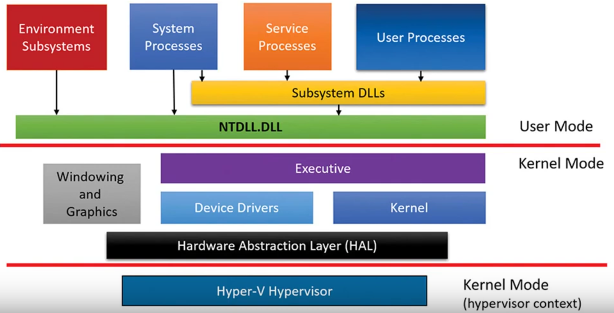

| 🏠 [Home](../../redteam.md) | ⬅️ ⬅️ [Part](../_part) | ⬅️ [Chapter](./_chapter) |
|-----------------------------|----------------------|-------------------------|

* [System architecture overview](../../knowledge/internals/archi_overview.md)

# System architecture overview

{#fig:windows_siplified_archi
width="\\linewidth"}

-   user-mode:

    -   **Service processes** are processes that host Windows services,
        such as the Task Scheduler and Print Spooler services

    -   **System processes** are fixed, or hardwired, processes, such as
        the logon process and the Session Manager, that are not Windows
        services. That is, they are not started by the **Service Control
        Manager**

    -   Environment subsystem server processes implement part of the
        support for the OS environment, or personality, presented to the
        user and programmer.

-   kernel-mode:

    -   **Executive (`Ntoskrnl.exe`)** contains the base OS services,
        such as memory management, process and thread management,
        security, I/O, networking, and inter-process communication.

    -   **Windows kernel (`Ntoskrnl.exe`)** consists of low-level OS
        functions, such as thread scheduling, interrupt and exception
        dispatching, and multiprocessor synchronization. It also
        provides a set of routines and basic objects that the rest of
        the executive uses to implement higher-level constructs.

    -   **Device drivers** includes both hardware device drivers, which
        translate user I/O function calls into specific hardware device
        I/O requests, and non-hardware device drivers, such as file
        system and network drivers.

    -   **Hardware Abstraction Layer (HAL)(`hal.dll`)** layer of code
        that isolates the kernel, the device drivers, and the rest of
        the Windows executive from platform-specific hardware
        differences (such as differences between motherboards).

    -   **windowing and graphics system (`Win32k.sys`)** implements the
        graphical user interface (GUI) functions (aka Windows USER and
        GDI functions), such as dealing with windows, user interface
        controls, and drawing.

    -   **hypervisor layer (`hdvix64.exe`, `hvax64.exe`)** is composed
        of a single component: the hypervisor itself. he hypervisor is
        itself composed of multiple internal layers and services, such
        as its own memory manager, virtual processor scheduler,
        interrupt and timer management, synchronization routines, ....

`ntdll.dll` : Internal support functions and system service dispatch
stubs to executive functions

`kernel32.dll, advapi32.dll, user32.dll,gdi32.dll`: core windows
subsystem dlls
