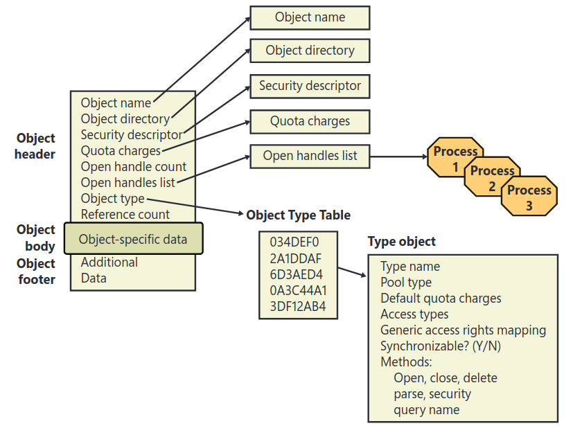

| 🏠 [Home](../../redteam.md) | ⬅️ ⬅️ [Part](../_part) | ⬅️ [Chapter](./_chapter) |
|-----------------------------|----------------------|-------------------------|

* [Object manager](../../knowledge/internals/obj_manager.md)
    * [Object types](../../knowledge/internals/obj_manager#object-types)
    * [Object manager namespace (OMNS)](../../knowledge/internals/obj_manager#object-manager-namespace-omns)
    * [Executive Objects](../../knowledge/internals/obj_manager#executive-bjects)
    * [Object structure](../../knowledge/internals/obj_manager#object-structure)
    * [Object methods](../../knowledge/internals/obj_manager#object-methods)
        * [Security methods](../../knowledge/internals/obj_manager#security-method)
    * [Object handles and the process handle table](../../knowledge/internals/obj_manager#object-handles-and-the-process-handle-table)

# Object manager

**Part 2 chapter 8**

The object manager responsible for creating, deleting, protecting, and
tracking Windows executive objects and abstract data types that are used
to represent OS resources such as processes, threads, and the various
synchronization objects.

-   Sysinternals WinObj

-   Process Explorer

-   Sysinternals Handle

-   Ressource Monitor

-   Kernel debugger `!handle`

## Object types

three primary types of objects:

-   executive objects: are objects implemented by various components of
    the executive

-   kernel objects: not visible to user-mode code, provide fundamental
    capabilities such as synchronization on which executive objects are
    built (execuive objects encapsulate one or more kernel objects).

-   GDI/ User objects: belong to windows subsystem and no not interact
    with kernel

<!-- -->

-   the kernel maintains a list of all types of objects it supports.

-   types have different supported operations and security properties

-   `Get-NtType`

## Object manager namespace (OMNS)

        Get-ChildItem NtObject:\ | Sort-Object Name
        Get-ChildItem NtObject:\Dfs | Sort-Object Name

The **Primary Namespace** in Windows Object Manager refers to the main,
global namespace that organizes system objects. It is essentially the
root namespace where system objects are created and accessed. The
primary namespace serves as the central reference point for all objects
that can be accessed or manipulated in the system.

The objects in the primary namespace are globally accessible (subject to
security and access control) and are referenced by their object names or
handles.

Characteristics of the Primary Namespace:

-   Global Accessibility: Objects are available throughout the entire
    system.

-   Well-Known Object Types:

-   Access Control: Access control mechanisms (like ACLs and security
    descriptors) are used to govern which processes can access objects
    in the primary namespace.

The **Secondary Namespace** in the Windows Object Manager refers to a
set of namespaces that are used for organizing objects in a more
specific context or scope. hese namespaces are typically created for
particular subsystems, applications, or kernel components that need to
isolate or manage objects within their own boundaries.

Characteristics of the Secondary Namespace:

-   Specialized Scope: are usually specific to a particular subsystem or
    context, and they are isolated from the primary namespace

-   Restricted Access: Objects might not be accessible by all processes.
    The access to secondary namespace objects can be more restricted,
    and processes might need to explicitly request access.

-   Namespacing for Isolation: Secondary namespaces provide a way to
    logically isolate objects so that different applications or
    subsystems can have their own namespaces and avoid conflicts or
    unintended access to one another's objects.

Examples of Secondary Namespace Objects:

-   Windows Registry:

-   Security Objects: The Security namespace is another example, where
    security-related objects (like access tokens, privileges, and
    security descriptors) are organized and managed.

-   Process Namespace: Each running process in Windows can have its own
    namespace for objects such as memory space, threads, and resources.

-   Device Namespace

## Executive Objects

Each Windows environment subsystem projects to its applications a
different image of the operating system. The executive objects and
object services are primitives that the environment subsystems use to
construct their own versions of objects and other resources

Executive objects are typically created either by an environment
subsystem on behalf of a user application or by variuous componets of
the OS as part of their normal operation.

The Windows subsystem uses executive objects to export its own set of
objects, many of which correspond directly to executive objects.

## Object structure

-   The object manager controls the object headers and footer

-   The executive components control the object body and type

{#fig:windows_object_structure width="\\linewidth"}

the object `type object` contains info common to each instance.

Additionally, up to eight optional subheaders exist: The name
information header, the quota information header, the process
information header, the handle information header, the audit information
header, the padding information header, the extended information header,
and the cre ator information header.

If the extended information header is present, this means that the
object has a footer, and the header will contain a pointer to it.

In addition to the object header, which contains information that
applies to any kind of object, the subheaders contains
optionalinformation regarding specific aspects ot he object. Note that
these structures are located at a variable offset from the start of the
object header, the value of which depends on the number of subheaders
associated with the main object header (except creator info).

**windows internals part 2 chapter 8 page 131**

## Object methods

**windows internals part 2 chapter 8 page 140**

### Security method

When an executive component defining an object doesn't want to override
the SRM's default security policy, it marks the object type as having
default security.

An object with default security (mutexes, events, semaphores) stores its
security information in its header, and its security method is
`SeDefaultObjectMethod`

An object that doesn't rely on default security must manage its own
security information and supply a specific security method.

A file object is an example of an object that overrides default
security. The I/O manager, which defines the file object type, has the
file system driver on which a file resides manage (or choose not to
implement) the security for its files. Thus, when the system queries the
security on a file object that represents a file on an NTFS volume, the
I/O manager file object security method retrieves the file's security
using the NTFS file system driver

## Object handles and the process handle table

**windows internals part 2 chapter 8 page 143**

Each process object in the kernel has an **handle table** containing:

-   the handle's numeric identifier

-   the granted access to the handle

-   the pointer to the object structure in kernel memory
