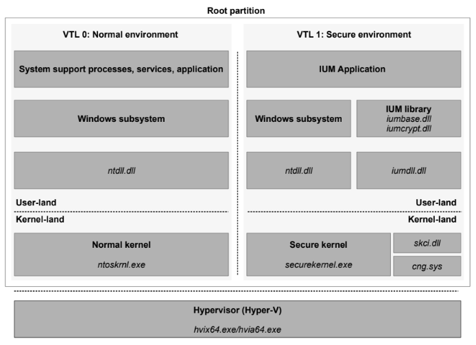

| 🏠 [Home](../../redteam.md) | ⬅️ ⬅️ [Part](../_part) | ⬅️ [Chapter](./_chapter) |
|-----------------------------|----------------------|-------------------------|

* [Virtualization-based security](../../knowledge/internals/vbs.md)
    * [Architecture](../../knowledge/internals/vbs#architecture)
    * [Trustlet](../../knowledge/internals/vbs#trustlet)
    * [Credential Guard](../../knowledge/internals/vbs#credential-guard)

# Virtualization-based security

## Architecture

In Windows 10, Microsoft now leverages the Hyper-V hypervisor through
the introduction of **Virtual Trust Levels (VTLs)** to provide a new set
of services known as **virtualization-based security (VBS)** aka
**Virtual Secure Mode (VSM)**:

-   Device Guard: This provides Hypervisor Code Integrity (HVCI) for
    stronger code-signing guarantees over KMCS alone, and allows for the
    customization of the signature policy of the Windows OS, for both
    user-mode and kernel-mode code.

-   Hyper Guard This protects key kernel-related and hypervisor-related
    data structures and code.

-   Credential Guard This prevents unauthorized access to domain account
    credentials and secrets, combined with secure biometrics.

-   Application Guard This provides an even stronger sandbox for the
    Microsoft Edge browser.

-   Host Guardian and Shielded Fabric These leverage a virtual TPM
    (v-TPM) to protect a virtual machine from the infrastructure it's
    running on

Virtual Trust Levels (VTLs).

-   operating system and its components are in a less privileged mode
    (`VTL0`)

-   VBS technologies run at `VTL1` (a higher privilege)

kernel and user mode exist within each VTL, and the hypervisor manages
privileges across VTLs. The regular kernel and drivers, running in
`VTL0`, cannot be permitted to control and define `VTL1` resources.

`VTL0` is unaware of the existence of `VTL1`.

{#fig:vbs_archi
width="\\linewidth"}

{#fig:vbs_archi_detailed
width="\\linewidth"}

with VBS:

-   `VTL0` kernel-mode code cannot touch `VTL1` user-mode

-   `VTL1` user-mode code cannot touch `VTL0` kernel-mode

-   `\verb`VTL1++ user-mode applications must still go through regular
    Windows system calls and their respective access checks if they wish
    to access resources.

**copy-on-write mechanisms, prevent `VTL0` applications from making
changes to binaries used by `VTL1`.**

The **secure kernel (`securekernel.exe`)** (aka *p*roxy kernel):

-   does not implement a full range of system capabilities, it
    hand-picks which system calls it will forward to the `VTL0` kernel.
    Any kind of I/O, including file, network, and registry-based, is
    completely prohibited. Graphics, as another example, are out of the
    question.

-   have complete access to `VTL0` memory and resources

-   limit the `VTL0` OS access to certain memory locations by leveraging
    CPU hardware support known as **Second Level Address Translation
    (SLAT)** (SLAT).

It can leverage:

-   **Second Level Address Translation (SLAT)**:

    -   to limit the `VTL0` OS access to certain memory locations
        (**Credential guard**)

    -   nterdict and control execution of memory (**Device Guard**)
        locations

-   **I/O memory management unit (MMU)** which effectively virtualizes
    memory access for devices to prevent normal device drivers from
    leveraging hardware devices to directly access memory. This can be
    used to prevent device drivers from using direct memory access (DMA)
    to directly access the hypervisor or secure kernel's physical
    regions of memory. This would bypass SLAT because no virtual memory
    is involved.

Because the hypervisor is the first system component to be launched by
the boot loader, it can program the SLAT and I/O MMU as it sees fit,
defining the `VTL0` and 1 execution environments. Then, while in `VTL1`,
the boot loader runs again, loading the secure kernel, which can
configure the system further to its needs. Only then is the VTL dropped,
which will see the execution of the normal kernel, now living in its
`VTL0` jail, unable to escape.

Only a special class of specially **signed binaries**, called
**Trustlets**, are allowed to execute in `VTL1`.

-   Each Trustlet has a unique identifier and signature

-   the secure kernel has hard-coded knowledge of which Trustlets have
    been created so far

As such, it is impossible to create new Trustlets without access to the
secure kernel and existing Trustlets cannot be patched in any way.

**IUM**, it's both:

-   an environment that restricts the allowed system calls that regular
    user-mode DLLs can make (thus limiting which of these DLLs can be
    loaded)

-   a framework that adds special secure system calls that can execute
    only under `VTL1`.

These additional system calls are exposed in a similar way as regular
system calls:

-   `Iumdll.dll`: The IUM Native Layer DLL implements the secure system
    call stub. It's the equivalent of `Ntdll.dll` of `VTL0`.

-   `IumCrypt.dll`: Exposes public/private key encryption functions used
    for signing and integrity verification. Most of the crypto functions
    exposed to `VTL1` are implemented in `Iumbase.dll`; only a small
    number of specialized encryption routines are implemented in
    `IumCrypt`. `LsaIso` is the main consumer of the services exposed by
    `IumCrypt`, which is not loaded in many other trustlets.

-   `Iumbase.dll` The IUM Base Layer DLL is the library that implements
    most of the secure APIs that can be consumed exclusively by `VTL1`
    software. It provides various services to each secure process, like
    secure identification, communication, cryptography, and secure
    memory management. Trustlets do not usually call secure system calls
    directly, but they pass through `Iumbase.dll`, which is the
    equivalent of `kernelbase.dll` in `VTL0`.

A trustlet can be designed to run both in `VTL1` and `VTL0`. In that
case, it should only use routines implemented in the standard `VTL0` API
surface since all the services available to `VTL0` are also implemented
in `VTL1`. For example, a trustlet can never do any registry I/O and any
file I/O, but it can use synchronization routines, ALPC, thread APIs,
and structured exception handling, and it can manage virtual memory and
section objects. Almost all the services offered by the `kernelbase` and
`kernel32` libraries perform system calls through `Ntdll.dll`. In
`VTL1`, these kinds of system calls are *t*ranslated in normal calls and
redirected to the `VTL0` kernel. Normal calls are often used by IUM
functions and by the Secure Kernel itself. This explains why `ntdll.dll`
is always mapped in every trustlet.

## Trustlet

## Credential Guard

Chapter 7

while RunAsPPL protection does guard the NT one-way function (NTOWF) and
TGT key from user-mode attackers, it does not protect against kernel
attackers or user-mode attackers that leverage vulnerabilities drivers.

Credential Guard solves this problem by using another process,
`Lsaiso.exe`, which runs as a Trustlet. This process therefore stores
the user's s secrets in its memory, not in `Lsass`.

As `VTL1` does not have any drivers or access to I/O of hardware of any
kind, Isolated LSA cannot directly communicate with the other servers
(KDC,...). This is still the responsibility of the Lsass process.

This seemingly results in a problem: the TGT and its key/NTOWF
transiently pass through Lsass during authentication, and the TGT and
its key are somehow available to Lsass for the generation of service
tickets.

This leads to two questions: How does Lsass send and receive the secrets
from isolated ISA, and how can we prevent an attacker from doing the
same?

To answer the first question, recall that Chapter 3, "Processes and
jobs," described which services are available to Trustlets. One was the
Advanced Local Procedure Call (ALPC), which the Secure Kernel supports
by proxying the `NtAlpc*` calls to the Normal Kernel. Then, the Isolated
User Mode nvironment implements support for the RPC runtime library
(Rpcrt4.dll) over the ALPC protocol, which allows a VTL 0 and VTL 1
application to communicate using local RPC just like any other
application and service.

To answer the first question, Although Lsass sits in the middle as a
proxy would, it only sees encrypted traffic between the KDC and isolated
LSA, without the ability to understand its contents.

Isolated LSA establishes a **local session key**, which only lives in
`VTL1`, and then uses a secure protocol to send this session key
encrypted with yet another key (user NTLM ?), which only the KDC has.

The KDC can then respond with the TGT and its key after encrypting it
with the isolated LSA session key. Therefore, Lsass sees an encrypted
message to the KDC (which it can't decrypt) and an encrypted message
from the KDC (which it can't decrypt).

Because disabling Credential Guard (which is ultimately nothing more
than a registry setting) is trivial for an attacker, Secure Boot and
UEFI can be leveraged to prevent a non-physically present administrator
from disabling Credential Guard.

[Fonctionnement de Credential
Guard](https://learn.microsoft.com/fr-fr/windows/security/identity-protection/credential-guard/how-it-works)

[Considérations et problèmes connus liés à l'utilisation de Credential
Guard](https://learn.microsoft.com/fr-fr/windows/security/identity-protection/credential-guard/considerations-known-issues)

[Protection des informations d'identification à
distance](https://learn.microsoft.com/fr-fr/windows/security/identity-protection/remote-credential-guard?tabs=intune)

-   [Credential Guard Bypass Via Patching Wdigest
    Memory](https://github.com/wh0amitz/BypassCredGuard)

-   [Revisiting a Credential Guard
    Bypass](https://itm4n.github.io/credential-guard-bypass/)
